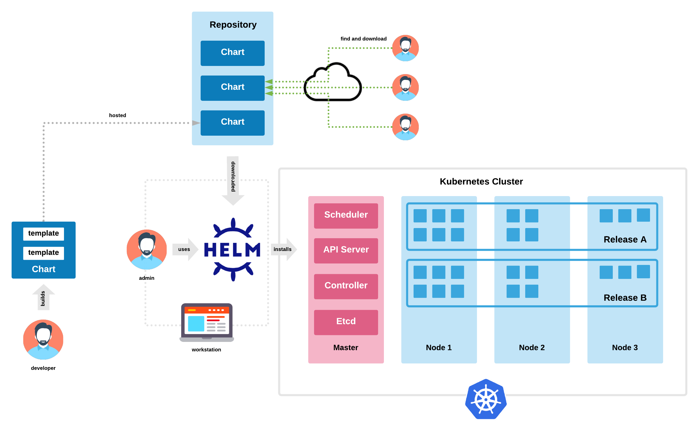
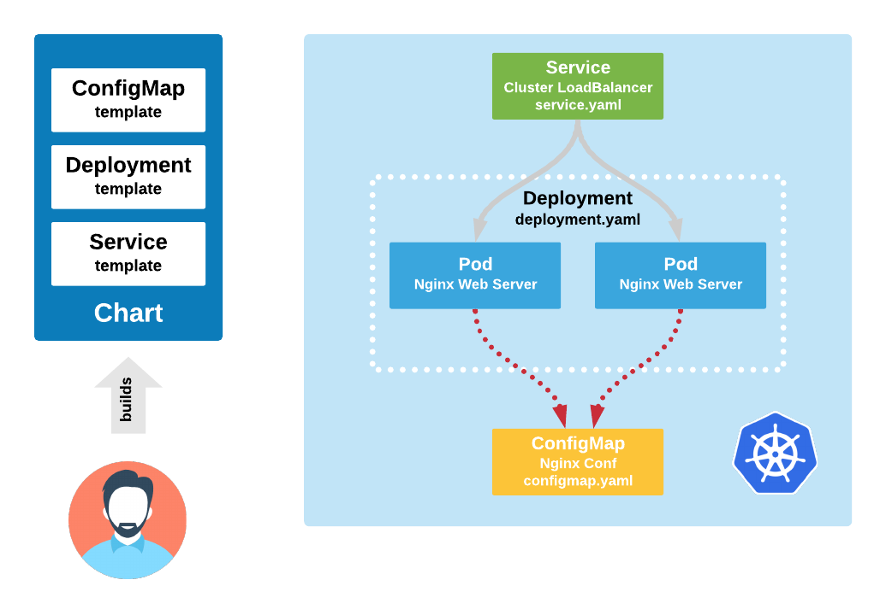

# Helm Chart Demonstration Resources

The following instructions are used to demonstrate how to build, package, and install a Helm custom chart.



The custom ```devopsmonk-webapp``` Helm chart when installed creates the following cluster resources:



:metal:

# STEP 1:
Package the ```devopsmonk-webapp``` chart

```
helm package devopsmonk-webapp/
```

# STEP 2:
Install the ```devopsmonk-webapp``` chart into Kubernetes cluster

Note: assumes that you have a cluster credentials configured within your local ```~/.kube/config``` file

```
helm install nginx-test helm-webapp-0.1.0.tgz
```

# STEP 3:
Examine newly created Helm chart release, and all cluster created resources

```
helm ls

kubectl get all
```

# STEP 4:
If using minikube, then run ```minikube ip``` and get the ip.In browser url submit ```minikubeip:30007``` and confirm that the response containse the ```Devops-Monk helm tutorial 2020``` message stored in the ```values.yaml``` file

```
minikube ip

run in browser: <minikubeip>:30007
```

# STEP 5:
Perform a Helm upgrade on the ```nginx-test``` release

```
helm upgrade nginx-test helm-webapp-0.1.0.tgz --set nginx.conf.message="Helm Rocks"
```

# STEP 6:
Perform another HTTP GET request. Confirm that the response now has the updated message ```Helm Rocks```

```
minikube ip

run in browser: <minikubeip>:30007
```

# STEP 7:
Examine the ```nginx-test``` release history

```
helm history nginx-test
```

# STEP 8:
Rollback the ```nginx-test``` release to previous version

```
helm rollback nginx-test
```

# STEP 9:
Perform another HTTP GET request. Confirm that the response has now been reset to the ```Devops-Monk helm tutorial 2020``` message stored in the ```values.yaml``` file

```
minikube ip

run in browser: <minikubeip>:30007
```

# STEP 10:
Uninstall the ```nginx-test``` release

```
helm uninstall nginx-test
```
